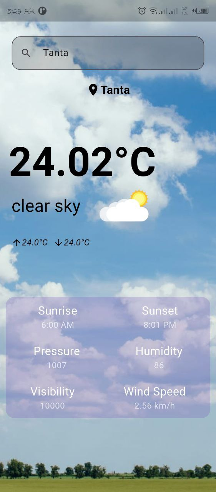
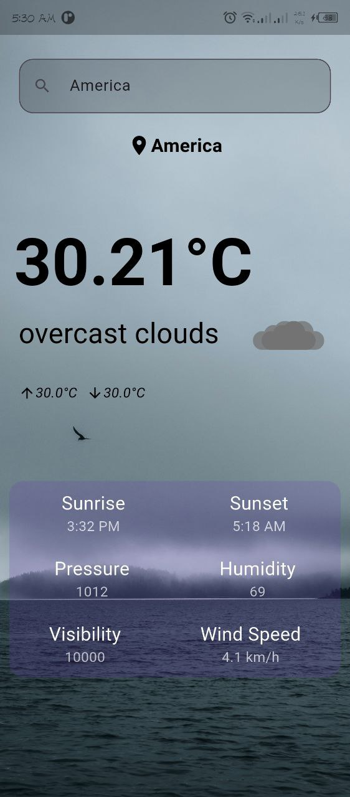
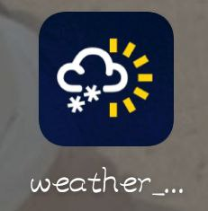

# 🌤 Weather App

A beautiful and simple weather app built using **Flutter**.  
It fetches weather data based on the user's current location or a searched city using the **OpenWeatherMap API**.

---

## 📱 Features

- 🔍 Search for weather by city name
- 📍 Automatically fetch weather using current location
- 🌤 Dynamic weather backgrounds and icons based on condition
- 🌡 Display temperature, humidity, pressure, wind speed, sunrise & sunset
- 🧊 Responsive design using `flutter_screenutil`

---

## 🛠 Tech Stack

- **Flutter**
- **Dart**
- **OpenWeatherMap API**
- `geolocator` for location services
- `flutter_screenutil` for responsive UI

---

## 📦 Packages Used

| Package              | Purpose                          |
|----------------------|----------------------------------|
| `dio`                | API requests                     |
| `geolocator`         | Access location services         |
| `flutter_screenutil` | Responsive design                |

---

## 🚀 How to Run

```bash
# 1. Clone the repository
git clone https://github.com/iahmedmostafa/Weather_app.git
cd Weather_app

# 2. Install dependencies
flutter pub get

# 3. Run the app
flutter run
```
📸 Screenshots:





## License:
This project is licensed under the MIT License - see the LICENSE file for details.

## Developed by
Ahmed Mostafa 
GitHub: [@iahmedmostafa](https://github.com/iahmedmostafa)